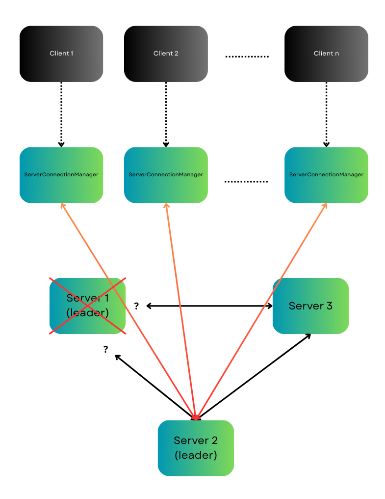

# Tetristributed — three-server cluster

The 2-fault-tolerant version of [Tetristributed](../tetris_demo/readme.md): three server replicas keep a co-op multiplayer Tetris game alive through server crashes, mid-game.

For the game itself (mechanics, protocol, screenshots) see the [main readme](../tetris_demo/readme.md). This folder is about the distributed part.

## How it works

- **Leader-follower**: three Node processes (IDs 0–2) on client ports 3001–3003 and cluster ports 4001–4003. The server with the lowest live ID is the leader; only the leader talks to clients and simulates games.
- **Heartbeats & election**: every server heartbeats its peers every 2 s. If the leader goes silent for 6 s, each survivor independently elects the lowest surviving ID (`clusterManager.js`).
- **State replication**: the leader streams per-frame `gameStateUpdate` messages for every active room, plus a full snapshot of all rooms every 3 s, so a follower can take over having lost at most a frame or two.
- **Client failover**: clients discover the leader via a `checkLeader` probe; followers 303-redirect page loads to the leader. When a client's connection drops, it pings the other servers' `/status` endpoints, redirects the browser to the first that answers, and automatically rejoins its room from the session saved in `localStorage` — score intact.
- **Room recovery**: if a rejoin lands on a follower that hasn't seen the room, the follower fetches a snapshot from the leader over the cluster socket (`room-request`).



## Running the cluster

```bash
cd server && npm install
./start-cluster.sh          # starts servers 0, 1, 2 on ports 3001-3003

cd ../client && npm install
npm start                   # opens the game at localhost:3000
```

`server/cluster-config.json` and `client/public/config.json` default to `localhost`. To play across machines on a LAN, put the host machine's IP (`ipconfig getifaddr en0` on macOS) in both files.

## Watching a failover

1. Start the cluster and a game (create a room, ready up, start playing).
2. Kill the leader: `./kill-server.sh 0` (or `curl -X POST localhost:3001/kill`).
3. Within ~6 s servers 1 and 2 detect the missed heartbeats and server 1 elects itself leader. The client notices the dropped socket, redirects to a live server, and rejoins the game where it left off.
4. Kill server 1 too — server 2 takes over the same way. That's 2-fault tolerance.

`curl localhost:3002/status` shows each server's view of the cluster (`isLeader`, `leaderId`, `connectedServers`, `rooms`).

`./stop-cluster.sh` shuts everything down.
