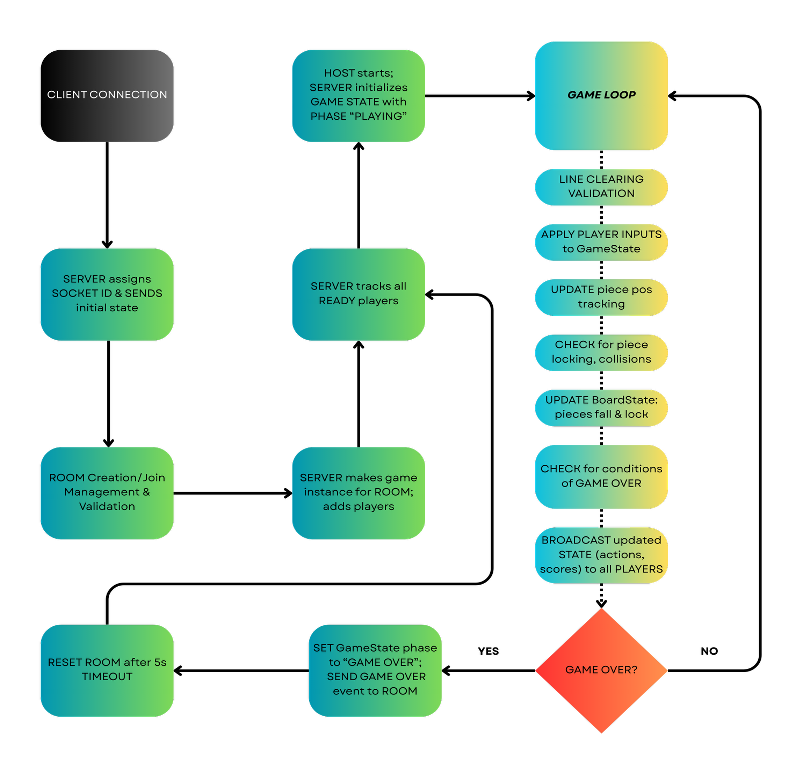
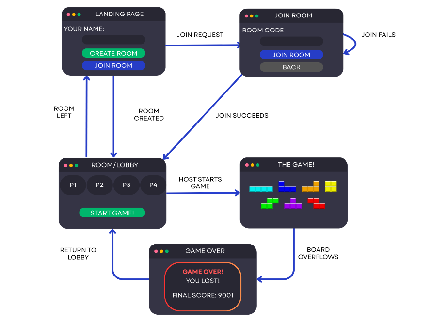

# Tetristributed

Co-op multiplayer Tetris over the network: every player controls their own falling piece on one shared board, in real time, at 60 FPS.

**[▶ Play it live](https://distributed-systems-dries-projects-e525fe65.vercel.app/)** — client on Vercel, server on Render. The backend runs on Render's free tier and sleeps when idle, so the first connection can take ~30–60 s to wake it.

Built by [Dries Rooryck](https://github.com/drooryck) and Joseph Oronto-Pratt as the final project for Harvard's CS 2620 (Distributed Programming). See the [write-up (PDF)](../CS_2620_Final_Project_Writeup.pdf) and [poster (PDF)](readme/poster_cs262.pdf) for the full story.

## What's in this folder

This is the **single-server** version of the game — the cleanest codebase for reading and local play. The **three-server, 2-fault-tolerant cluster** version (leader election, heartbeats, state replication, client failover) lives in [`../tetris`](../tetris).

```
server/   Node + Express + Socket.IO game server (authoritative, 60 FPS tick)
client/   React + Konva frontend (canvas rendering, animations)
```

## Quickstart

```bash
# Terminal 1 — server (port 3001)
cd server && npm install && npm start

# Terminal 2 — client (port 3000, opens a browser)
cd client && npm install && npm start
```

Create a room, share the 6-character room code, have friends join from their browser, ready up (X), and the host starts the game. Up to 4 players per room.

## Gameplay

- **Shared board** that widens with player count: 10 columns solo, 14 / 21 / 28 for 2 / 3 / 4 players, each player with their own spawn zone and piece color.
- **Nintendo Rotation System** (NES-faithful: four rotation states, no wall kicks), DAS auto-shift (14-frame delay, 2-frame repeat), 30-frame lock delay with up to 15 lock resets, 12-frame entry delay.
- **Pieces collide in the air** — including against other players' active pieces; locking is only allowed on the floor or on locked blocks (this makes hard-drops onto another player behave correctly).
- **Scoring**: 100 per line clear, +1 per soft-dropped cell, +2 per hard-dropped cell. Game ends when any player tops out; the team's summed score is the final score.
- Line-clear particle explosions, lock flashes, rotating backgrounds, and sound cues, all synchronized to the server's authoritative animation timers.

| Key | Action |
|---|---|
| ← → | Move (hold for auto-shift) |
| ↓ | Soft drop |
| ↑ / Z | Rotate |
| Space | Hard drop |
| X | Ready up (lobby) |

## Architecture

The server is authoritative: clients only send inputs (`playerAction`), the server simulates every room in a 60 FPS loop and broadcasts the resulting `gameState` to the room. Rooms are keyed by 6-character codes; each room has its own game loop, players, and board.





### Socket protocol (client ⇄ server)

| Client emits | Server emits |
|---|---|
| `createRoom { playerName }` | `roomCreated { roomCode, gameState }` |
| `joinRoom { roomCode, playerName }` | `roomJoined` / `playerJoined` / `error` |
| `rejoinRoom { roomCode, playerName, previousSocketId }` | `roomRejoined` / `playerRejoined` |
| `ready` | `playerReady { gameState }` |
| `startGame` (host only) | `gameState` (60 FPS during play) |
| `playerAction { type, ... }` | `gameOver { score, totalScore, ... }` |
| `leaveRoom` | `roomLeft` / `playerLeft` / `hostAssigned` |

Disconnecting mid-game parks the player in `disconnectedPlayers` (score preserved); reconnecting with the same session (kept in `localStorage`) restores them into the running game. Joining a room whose game is in progress is rejected.

### Fault tolerance (the "distributed" part)

The cluster version in [`../tetris`](../tetris) runs three server replicas. One leader (lowest live server ID) owns all game state and serves clients; followers receive per-frame incremental updates plus a full snapshot every 3 s. Failure of the leader is detected by missed heartbeats (2 s interval, 6 s timeout), the remaining servers elect the lowest surviving ID, and clients redirect and rejoin their room on the new leader — mid-game.


## Tests

```bash
cd server && npm test    # unit (game logic) + integration (real server + socket.io clients)
cd client && npm test    # component tests (React Testing Library)
cd server && npm run test:load   # artillery load test (server must be running)
```
